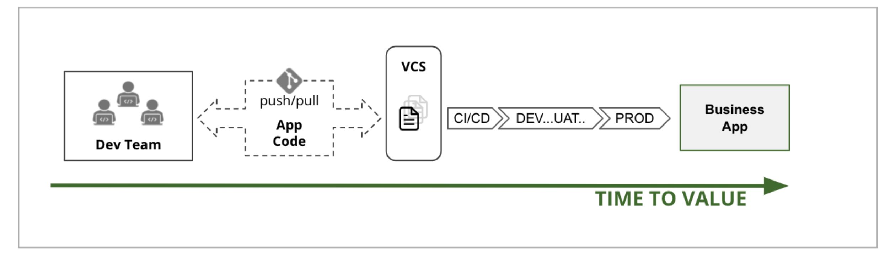

# “Everything as Code” - 5 Tools für ein dynamisches Multi-Cloud Datacenter

## Ein Multi-Cloud Betriebssystem mit HashiCorp Tools

Mit der Einführung des iPhones im Jahre 2007 und somit dem Beginn von “Mobile Technology”, wurde es normal, von überall und zu jeder Zeit auf sämtliche Apps unabhängig vom Device zuzugreifen. Bring your own Device (BYOD) ist heute kein Sicherheitsrisiko mehr, sondern gelebter Standard. Die damit verbundene “App Mentalität” hat außerdem dazu geführt, dass Services, die ursprünglich zur Abwicklung eines Geschäftsprozesses im Hintergrund liefen, heute direkt von den Anwendern einer App genutzt werden. Hotelreservierung, Flug- und Reisebuchung, Online-Banking, Gaming, Shopping und Social-Media sind nur einige Beispiele hierfür. 
Diese Veränderungen sind mitunter die Ursache dafür, dass die Anforderungen an die IT, bezüglich Zeit und Aufwand von der Entwicklung bis zur Bereitstellung einer Applikation, massiv gestiegen sind. Die Zeit zwischen einer Idee bis zu ihrer Umsetzung (Time to Value) ist zur entscheidenden Kenngröße geworden. 
Dies alles sind die treibenden Faktoren eines Strukturwandels, dem sämtliche IT-Abteilungen ausgesetzt sind:

**Die digitale Transformation von einem statischen Datacenter in ein dynamisches Datacenter, in dem benötigte Ressourcen mittels eines automatisierten Prozesses bereitgestellt werden.**

Dynamisch bedeutet an dieser Stelle, dass sämtliche Ressourcen als Service abstrahiert in quasi unlimitierter Menge zur sofortigen Verwendung zur Verfügung stehen. Durch genau diese Abstraktion wird die Nutzung von Ressourcen zu Software, die mittels textueller Beschreibung, auch “Infrastructure as Code” genannt, automatisiert werden kann. Abgerechnet werden die Ressourcen anhand ihrer tatsächlichen Nutzung, was den dynamischen Ansatz noch um den der flexiblen und bedarfsgerechten Anpassung erweitert. Im Gegensatz dazu müssen wir in einem statischen Modell alle Ressourcen vorhalten, die zur Abwicklung der höchsten Last erforderlich sind - auch wenn das weniger als 5% der gesamten Zeit ausmacht.

Die Lösung ist die Definition eines modernen dynamischen Datacenters, in dem man gleichermaßen eigene Private Cloud Ressourcen sowie Ressourcen von diversen Public Cloud Providern nutzen kann. Ein dynamisches Datacenter ist demnach ein logisches Konstrukt, das einen konsistenten Workflow zur automatisierten Bereitstellung von Ressourcen zur Verfügung stellt und dabei die organisatorischen Anforderungen an Governance und Compliance berücksichtigt. Dies sind alles Anforderungen, die sich kaum mit dem aus der statischen Welt bekannten Ticket-System zur Koordination der einzelnen Aufwendungen vereinbaren lassen.
    
 
Hierbei ist das Ziel ist in aller Regel nicht, die Ressourcen des eigenen Datacenters überflüssig zu machen. Sofern die eigene IT-Organisation nicht erst vor kurzem auf der sogenannten grünen Wiese begonnen hat, sind bereits wesentliche Geschäftsprozesse auf den eigenen Ressourcen abgebildet. Es geht vielmehr darum, die Kernsysteme und somit auch die Kerninformationen bspw. eines Geschäftsprozesses innerhalb der eigenen Organisation (z.B. SAP, CRM, datenbankgestützte Geschäftsapplikationen) in eine private Cloud zu überführen und diese bedarfsgerecht und dynamisch mit den Ressourcen eines oder mehrerer Public Cloud Provider zu kombinieren. 
Nahezu alle Unternehmen verwenden Ressourcen im eigene Datacenter bereits in einer als Private-Cloud abstrahierten Form; gängige Lösungen dazu sind VMware, Nutanix, OpenStack uvam. Zudem werden oftmals Ressourcen eines oder mehrerer Public-Cloud Provider, eventuell in Kombination mit weiteren Plattform Services wie Kubernetes und Co. verwendet. Somit ist die Frage, ob die Zielarchitektur eine Private-, Hybride- oder Public-Cloud ist, faktisch bereits beantwortet: Multi-Cloud ist die neue Plattform, und diese ist bereits Realität in den allermeisten IT-Organisationen.

Es macht jedoch sowohl technologisch als auch methodisch einen großen Unterschied, ob man die statischen Ressourcen innerhalb des eigenen Datacenters verwendet oder auf dynamische Cloud Ressourcen zugreift. Die Verantwortung über die Ressourcen in einem dynamischen Datacenter unterliegt in aller Regel auch nicht einer einzelnen Personengruppe (Unicorn Developer), sondern ist, wie in einem klassischen Datacenter auch, in unterschiedliche Layer aufgeteilt. Um die prozessuale Kontrolle über die Verwendung der Ressourcen zu behalten, werden diese Layer von unterschiedlichen Teams mit unterschiedlichen Spezialisierungen verantwortet. Diese Layer sind:

- Infrastruktur-Provisionierung
- Netzwerk & Security 
- Applikations-Orchestrierung

Im Vergleich zur statischen Welt verhalten sich diese Layer aber so unterschiedlich, was somit eine einfache Übertragung der bestehenden Applikationen in ein dynamisches Datacenter nahezu unmöglich macht. Diese Unterschiede sind im Einzelnen:

###  Infrastruktur-Provisionierung 

Die Bereitstellung von Infrastruktur erfolgte im Blech-Zeitalter durch das manuelle Konfigurieren der benötigten Ressourcen, eventuell unterstützt durch eine „Point and Click“ Benutzeroberfläche. Der üblicherweise lange Lifecycle dieser Infrastruktur wurde mittels eines ITIL-basierten Ticketsystems verwaltet. 
Im Cloud-Zeitalter sind sowohl die Ressourcen im eigenen Datacenter als auch sämtliche Public-Cloud Ressourcen über unterschiedliche APIs abstrahiert. Der Zugriff auf die Ressourcen erfolgt über den entsprechenden API Endpunkt in einer provider-spezifischen Sprache. Die Bereitstellung von Infrastruktur kann dadurch mittels “Infrastructure as Code” automatisiert werden, was diesen Prozess zu reiner Software macht. Jedoch ist ein dynamisches Multi-Cloud Datacenter von heterogener Natur, da es eine Vielzahl von unterschiedlichen Cloud Provider APIs zu bedienen hat.

### Netzwerk & Security

Während man innerhalb des eigenen Datacenters noch die volle Kontrolle über sämtliche Netzwerkperimeter hat, gibt es diese in der Cloud nicht mehr. Beim Hinzufügen von weiteren Instanzen oder beim Verschieben von Workloads von einem Provider zu einem anderen, verändern sich die zugrundeliegenden IP-Adressen. Damit eignen sich statische IP-Adressen in einem dynamischen Datacenter weder als Basis für die Netzwerkkonnektivität noch als Basis für dessen Autorisierung mittels Firewalls. Das bedeutet nicht, dass Netzwerk Security in der Cloud hinfällig ist oder die Ressourcen ungeschützt sind. Statt basierend auf IP-Adressen, erfolgt die Autorisierung auf der Grundlage einer mittels Zertifikat (PKI) überprüfbaren Identität einer Applikation oder eines Services. Die IP-Adresse ist damit nicht mehr Basis, sondern eine dynamisch zugewiesenen Eigenschaft einer Identität.      

### Applikations-Orchestrierung

Zu Zeiten des statischen Datacenters wurden vornehmlich monolithische Applikationen direkt einer Infrastruktur (Server) zugeordnet. Die Ressourcen waren so bemessen, dass die Applikation die zu erwartende Maximallast verarbeiten konnte. Die Skalierung der Applikation erfolgte vertikal durch Hinzufügen von RAM, Disk oder CPU. Der Lifecycle und die “Uptime” wurden in einem manuellen Prozess überwacht und betrieben.
Im dynamischen Datacenter werden vornehmlich cloudfähige Applikationen oder Microservices betrieben. Es gibt keine direkte Zuordnung auf die Infrastruktur und die Skalierung erfolgt horizontal über das Hinzufügen weiterer Instanzen. Eine Anpassung an die tatsächliche Last ist somit jederzeit und automatisiert möglich.

## Prozesse und Workflows für ein dynamisches Datacenter 

Bevor wir auf die Tools eingehen, die die technologischen Implikationen in einem dynamischen Datacenter lösen können, sollten wir einen Blick auf die prozessualen Aspekte einer (Multi) Cloud Umgebung werfen. Im Kontext Business Value ist es oftmals das Ziel, eine Applikation möglichst schnell zu entwickeln und produktiv zu betreiben. Der Prozess oder Workflow, der zum “Value” führt, ist somit von entscheidender Bedeutung. Dieser legt fest, wie die Mitarbeiter die Tools bedienen, um schnell (agil) und skalierbar einen für die Organisation relevanten Mehrwert bzw. Value zu erzeugen. 

Ein gutes Beispiel für einen solchen Prozess kennen wir bereits aus der Software-Entwicklung, bei dem die gemeinschaftliche Bearbeitung des Applikations-Codes in einem Version Control System (kurz VCS genannt) organisiert wird. Gängige Varianten eines VCS sind beispielsweise GitHub, GitLab oder Bitbucket. Änderungen am Code innerhalb eines VCS können nur von autorisierten Entwicklern durchgeführt werden. Jede Änderung am Code führt automatisch zu einer neuen Version. Durch die Versionierung kann jede Veränderung nachvollzogen werden und bei Bedarf kann zu jeder beliebigen vorherigen Version zurückgekehrt werden. Jede Versionsänderung im VCS triggert einen Workflow (CI/CD Prozess), der den veränderten Code auf Fehler und Funktion testet. Das Resultat dieser automatisierten Tests geht zurück an das Entwicklungs-Team. Sofern alle Tests erfolgreich verlaufen sind, hat das Team eine Version der Codebasis erschaffen, die als Kandidat für die Produktionsumgebung geeignet ist. Ob der CI/CD Prozess einen Kandidaten automatisiert in die Produktionsumgebung überträgt, oder ob dies erst nach manueller Kontrolle erfolgt, liegt in der Verantwortung des Prozessdesigns - beides ist an dieser Stelle möglich.

Dieser Prozess kann vermutlich ohne großen Widerspruch als eine Art Blaupause für den agilen Entwicklungsprozess genommen werden.

In der abgebildeten Darstellung ignoriert er jedoch eventuelle Abhängigkeiten zu weiteren Artefakten, die zur Erbringung des Business Values erforderlich sind. Jeder reine Applikations-Code benötigt in irgendeiner Form Infrastruktur-Ressourcen, auf der die Applikation ausgeführt und netzwerkseitig erreichbar gemacht wird. 

Eine nicht selten anzutreffende prozessuale Lösung ist die Kombination aus agilem Entwicklungsprozess und dem klassischen Wasserfall Prozess. Ein Dev-Team generiert eigenverantwortlich und agil seinen Anteil am Value und fordert die benötigten Ressourcen zum Betreiben dieser Applikation mittels klassischem ITIL-Prozess-basierten Ticketsystem an. Die im Ticket angefragten Ressourcen werden dann sukzessiv, dem klassischen Wasserfallprozess folgend, bearbeitet.

Bezogen auf die gestiegenen Anforderungen an die IT ist ein Wasserfall-Agiler (Wagile) Prozess nicht das final erstrebenswerte Ziel, sondern bestenfalls ein erforderlicher Zwischenschritt. Denn egal wie schnell der eigentliche Applikations-Code auch erzeugt wird, ist ein Business-Value erst gegeben, wenn alle Bestandteile bzw. Artefakte zur Verfügung stehen. Im Wagile Fall macht der Wasserfall-Prozess die Geschwindigkeit des agilen Prozesses zunichte. 

Das finale Ziel muss also lauten, sämtliche benötigte Bestandteile bzw. Artefakte, die zum “Business Value” führen, in einem agilen und automatisiert reproduzierbaren Prozess zu generieren. Der Schlüssel zu einem solchen Prozess ist die Automatisierung durch Kodifizierung - alles wird zu Software!
Wie einleitend beschrieben, wird die Infrastruktur-Provisionierung mittels “Infrastructure as Code” zu reiner Software, so wie die Autorisierung von Netzwerkverbindungen und der Zugriff auf sensitive Informationen mittels “Policy as Code” zu reiner Software werden. 

Mit diesem “Everything as Code” Ansatz lässt sich nun ein “Business Value” in einem agilen Prozess generieren, der den gestiegenen Anforderungen an die IT-Abteilungen gerecht wird. 
Die manuelle Tätigkeit bezieht sich in einem agilen Prozess rein auf die Kodifizierung der Artefakte, welche dann in einem automatisierten Prozess erzeugt werden. Die Demarkationslinie ist das Version Control System, welches die Schnittstelle zwischen der Kodifizierung auf der linken Seite und der automatisierten Generierung des Artefaktes auf der rechten Seite darstellt.

Das Dev-Team erzeugt nun über die Iterationen x..y die Version Z als finales Artefakt für die Produktionsumgebung. Genauso wie das Ops-Team mittels “Infrastructure as Code” iterativ die Version Z ihres Artefakts erzeugt und das Sec-Team die Access- und Security-Regeln in ihrer Version Z. Wenn man nun die Z Versionen der 3 Artefakte in einem CI/CD Prozess zusammenbringt, hat man die komplette Beschreibung des “Scoped Business Values”, den man nun in dieser Form automatisiert (re)produzieren kann.
  
Das Schaubild oben veranschaulicht, wie der High-Level Prozess zum Erzeugen eines organisatorischen Business Values aussehen kann. Organisatorisch bedeutet an dieser Stelle, dass mehrere unterschiedliche Gruppen oder Rollen an der Erzeugung des Ergebnisses beteiligt sind. Gerade in regulierten Industriezweigen, wie dem Finanzwesen, Versicherungen oder beim Umgang mit sensitiven Daten im Allgemeinen, müssen regulatorische Maßgaben erfüllt werden. Das bedeutet im Umkehrschluss, dass die Verantwortungen für gewisse Vorgänge nicht von ein und derselben Personengruppe kontrolliert werden darf, sondern in unterschiedliche Teams aufgeteilt wird (Segregation of Duties). Selbst wenn dies keine gesetzliche Anforderung ist, gibt es in aller Regel interne organisatorische Anforderungen, die eine Aufteilung der Verantwortungen erfordern.  

## Tools und Prozesse in einem dynamischen Multi-Cloud Datacenter

Wie bisher beschrieben, sind die technologischen und prozessualen Anforderungen an die Tools innerhalb eines modernen und dynamischen Multi-Cloud Datacenters recht beachtlich. 

Schließlich will man mit diesem Fundament den Lifecycle von hunderten bis tausenden von unterschiedlichen Workloads/Applikationen managen. Es sollen sowohl die Ressourcen innerhalb der eigenen Private Cloud, als auch die Ressourcen von aktuellen und künftigen Public Cloud Providern genutzt werden  können. Man benötigt einen sicheren und skalierbaren Ansatz um Konnektivität über die Grenzen eines Provider hinweg zu ermöglichen. Dabei sollen Governance- und Compliance-Anforderungen individuell und flexibel angepasst werden können.   

Mit den folgenden 5 Tools möchte ich das Fundament eines dynamischen Datacenters beschreiben, mit denen sich alle technischen und prozessualen Anforderungen erfüllen lassen: 

